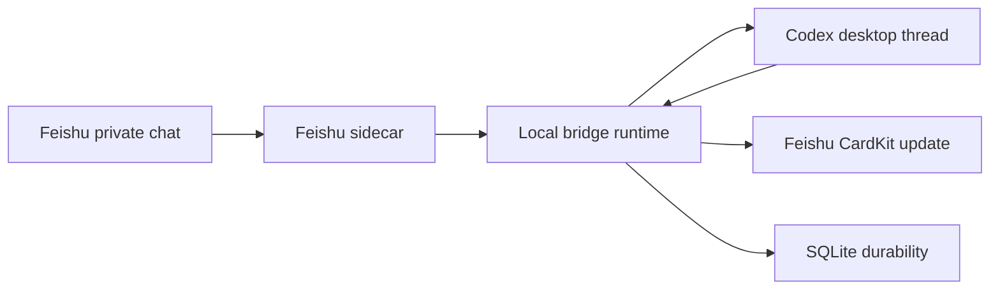

# Architecture

This toolkit assumes a local bridge-compatible implementation with these moving parts:

## Main Link

1. Feishu inbound message reaches the sidecar through long connection or an equivalent webhook adapter.
2. The sidecar validates app credentials, sender allowlist, and chat target.
3. The bridge binds the inbound message to an explicit Codex desktop thread binding.
4. Codex processes the message.
5. Assistant output is mirrored back to Feishu as a CardKit card.
6. SQLite keeps durable delivery, pending, restart, maintenance, and error records.

The normal message path should not watch the visible desktop conversation to decide where messages belong. Clicking or reading an old Codex conversation is user activity, not bridge routing input.

When a structured native/app-server route exists, prefer it over a fragile frontend helper for message submission. Frontend helpers may change shape between desktop builds; the bridge should classify those changes and fall back deliberately instead of retrying a broken helper.

## Message Mode Contract

Treat these message modes as the minimum bridge contract:

- Feishu to Codex: text.
- Feishu to Codex: image.
- Feishu to Codex: file.
- Feishu to Codex: text plus image.
- Codex to Feishu: text.
- Codex to Feishu: image.
- Codex to Feishu: file.
- Codex to Feishu: text plus image.
- Codex to Feishu: text plus file.

Classify messages from structured message type, attachment metadata, and native Codex turn events. Do not use visible-window state, OCR, or generated placeholder text as the source of truth.

For Feishu image-only inbound, submit the image attachment through the native attachment path and use an empty request body so Codex renders its native empty-content bubble. Do not synthesize a fake text label such as `[image]` as the user message body.

## Assistant Card Stream Contract

Assistant replies should update one visible Feishu card per logical reply:

- Thinking/reasoning text appends to the thinking section.
- Tool call summaries append to the tool section from structured tool events.
- Final assistant text appends to the final section.
- Completion state comes from terminal turn/item status, not from text-shape guesses.

If early parallel tool events arrive before the card object is ready, bind the card session before consuming active-output events. Avoid later catch-up replay as the normal path.

## Components

- Sidecar: handles Feishu transport and bot API calls.
- Bridge runtime: coordinates Codex desktop, explicit bindings, local state, pending queues, and delivery status.
- Config: local JSON containing app credentials and safety switches.
- SQLite store: protects against restart loss, stale pending state, and card finalization gaps.
- CardKit adapter: creates, patches, and finalizes Feishu assistant cards.
- Diagnostics: reports health, pending actions, SQLite quick_check, recent card state, and maintenance results.

## Stable Simplification Boundary

Verified simplification means deleting old detours and unused branches, not deleting protective behavior that keeps delivery correct. Keep these by default:

- SQLite quick_check and recovery state.
- Pending action tracking.
- CardKit finalization protection.
- Controlled restart verification.
- Maintenance/retention for bounded state.
- Read-only observation tools for health and recent card status.

When the bridge is forward-only, historical context snapshots and snapshot-based missing-message repair are valid deletion targets after the main link has independent delivery verification.

## Controlled Restart Exception

Controlled restart is allowed to use the stored origin conversation ID to navigate the desktop back to the pre-restart conversation. Verify this with renderer route or active-thread return values, not only with a generic health binding value.

## Context Compaction Boundary

Codex context compaction can happen between a committed inbound user turn and the visible desktop bubble update. If durable ledger and native session records prove the Feishu inbound turn was committed, the safe recovery is a one-shot route refresh for that same conversation. Do not resubmit, replay, or mutate message history to solve a visibility-only miss.

## Known Non-Goals

- Clipboard-based message handoff is considered a retired path. Keep it out of the main link unless a user explicitly opts into a separate experimental adapter.
- Do not use raw UI polling as the first-choice bridge path when a structured transport is available.
- Do not infer the bridge target from the visible conversation in the normal message path.
- Do not replay old Codex history into Feishu unless the user explicitly asks for archival synchronization.
- Do not treat message speed as the only metric; finalization correctness and restart recovery are part of stability.
